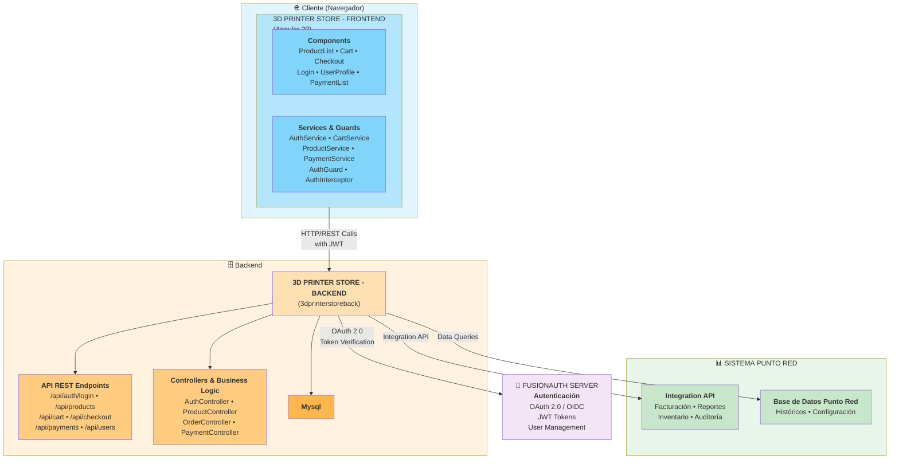
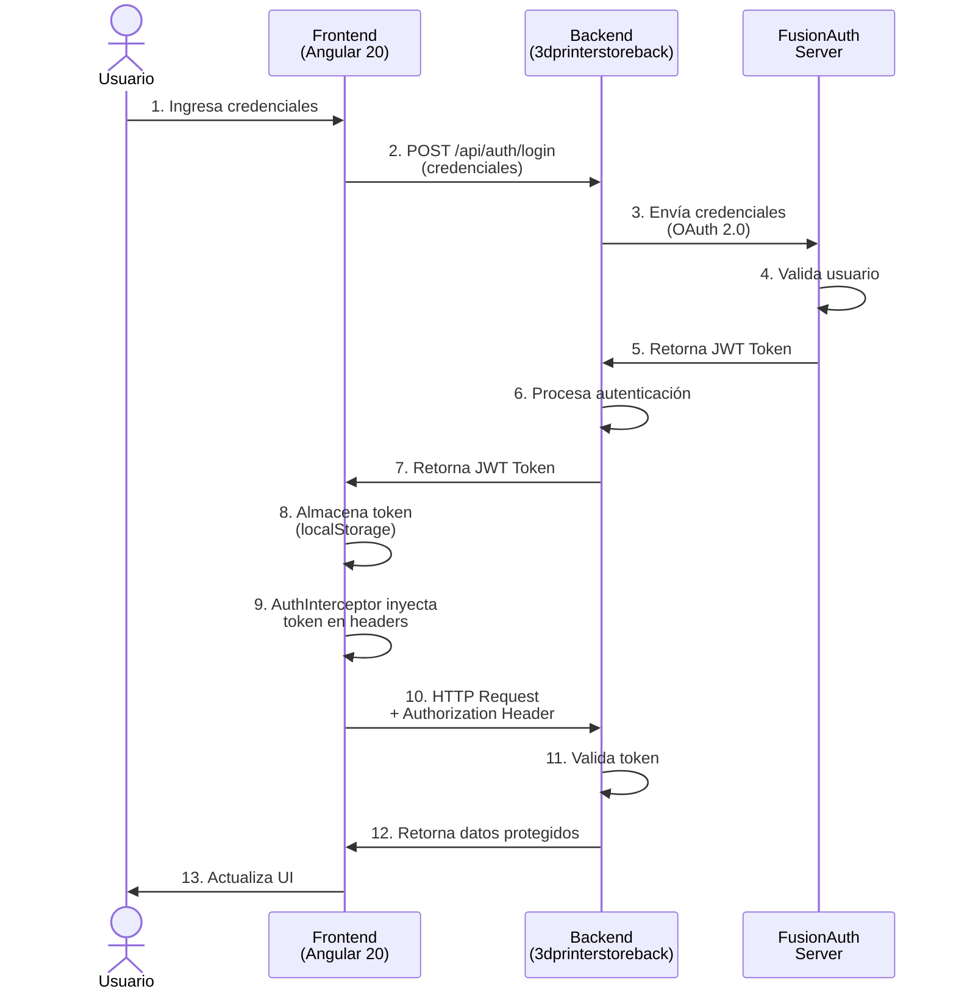

# 🖨️ 3D Printer Store - Frontend

[](https://angular.io/)
[](https://www.typescriptlang.org/)
[](https://material.angular.io/)
[](https://tailwindcss.com/)

Esta aplicacion es parte de la prueba tecnica de la empresa punto red , esta aplicacion fue desarrollada utilizando angular y tailwind css, este proyecto tiene como objetivo crear una tienda online de impresoras 3D donde los usuarios puedan comprar sus productos preferidos.

## 🏗 Arquitectura

### Diagrama de Arquitectura del Sistema



### Flujo de Autenticación



## 📋 Tabla de Contenidos

- [Características](#características)
- [Tecnologías](#tecnologías)
- [Requisitos Previos](#requisitos-previos)
- [Instalación](#instalación)
- [Uso](#uso)
- [Estructura del Proyecto](#estructura-del-proyecto)
- [Scripts Disponibles](#scripts-disponibles)
- [Arquitectura](#arquitectura)
- [Testing](#testing)
- [Deployment](#deployment)
- [Contribuir](#contribuir)

## ✨ Características

- **🛍️ Catálogo de Productos**: Visualización de impresoras 3D con detalles completos
- **🛒 Carrito de Compras**: Sistema de carrito con gestión local
- **🔐 Autenticación**: Login seguro con guardias de ruta
- **💳 Sistema de Pagos**: Integración con procesamiento de pagos
- **👤 Perfil de Usuario**: Gestión de datos de usuario
- **📄 Facturación**: Generación de facturas en PDF usando jsPDF
- **🎨 Diseño Responsivo**: Totalmente adaptable a dispositivos móviles
- **🌐 Temas Personalizados**: Temas Material Design personalizables

## 🛠 Tecnologías

### Frontend
- **Angular 20.3** - Framework principal
- **TypeScript 5.9** - Lenguaje de programación
- **Angular Material 20.2** - Componentes UI
- **TailwindCSS 3.4** - Utilidades CSS
- **RxJS 7.8** - Programación reactiva
- **jsPDF 3.0** - Generación de PDFs

### Herramientas de Desarrollo
- **Angular CLI 20.3** - Herramientas de construcción
- **Karma 6.4** - Test runner
- **Jasmine 5.9** - Framework de testing
- **PostCSS 8.5** - Procesamiento de CSS
- **Prettier** - Formateador de código

## 📦 Requisitos Previos

- **Node.js** 18.x o superior
- **npm** 9.x o superior (incluido con Node.js)
- **Angular CLI** 20.x instalado globalmente (opcional pero recomendado)

```bash
# Verificar versiones instaladas
node --version
npm --version

# Instalar Angular CLI globalmente (opcional)
npm install -g @angular/cli@20
```

## 🚀 Instalación

1. **Clonar el repositorio**
```bash
git clone https://github.com/tu-usuario/3dPrinterStoreFront.git
cd 3dPrinterStoreFront
```

2. **Instalar dependencias**
```bash
npm install
```

3. **Configurar variables de entorno**
```bash
# Crear archivo .env (si es necesario)
cp .env.example .env  # Ajusta según tus necesidades
```

## 💻 Uso

### Desarrollo

**Con proxy configurado (recomendado):**
```bash
npm start
```
La aplicación estará disponible en `http://localhost:4200/`

**Ejecución directa:**
```bash
npm run start:direct
```

### Construcción

**Build de producción:**
```bash
npm run build
```
Los artefactos compilados se almacenarán en `dist/3dprinterStore/browser/`

**Build con observación de cambios:**
```bash
npm run watch
```

## 📁 Estructura del Proyecto

```
src/
├── app/
│   ├── components/              # Componentes reutilizables
│   │   ├── cart/               # Componente de carrito
│   │   ├── checkout/           # Proceso de compra
│   │   ├── header/             # Encabezado
│   │   ├── footer/             # Pie de página
│   │   ├── login/              # Formulario de login
│   │   ├── product-list/       # Listado de productos
│   │   ├── product-detail/     # Detalle de producto
│   │   ├── payment-list/       # Historial de pagos
│   │   └── user-profile/       # Perfil de usuario
│   ├── services/                # Servicios de aplicación
│   │   ├── auth.ts             # Autenticación
│   │   ├── cart.ts             # Gestión de carrito
│   │   ├── product.ts          # Gestión de productos
│   │   ├── payment.ts          # Procesamiento de pagos
│   │   ├── auth-initializer.ts # Inicialización de auth
│   │   └── auth-interceptor.ts # Interceptor HTTP
│   ├── guards/                  # Guardias de ruta
│   │   └── auth.guard.ts       # Validación de autenticación
│   ├── constants/               # Constantes de la app
│   │   └── storage-keys.ts     # Claves de almacenamiento
│   ├── app.ts                   # Componente raíz
│   ├── app.config.ts            # Configuración de Angular
│   ├── app.routes.ts            # Rutas de la aplicación
│   └── app.css                  # Estilos del app
├── environments/                # Configuraciones por entorno
├── main.ts                      # Punto de entrada
├── styles.css                   # Estilos globales
├── custom-theme.scss            # Tema Material personalizado
└── index.html                   # HTML principal
```

### Convención de Nombres

```
✅ CORRECTO:
- Componentes: ProductListComponent, CartItemComponent
- Servicios: AuthService, ProductService
- Guards: AuthGuard
- Interfaces: IProduct, IUser
- Constantes: MAX_ITEMS, API_TIMEOUT

❌ INCORRECTO:
- Components: ProductList, cartitem
- Services: AuthServ, products
- Guards: authenticate
- Interfaces: Product, User (sin I)
- Constantes: maxItems, api_timeout

### Patrones Utilizados

- **Standalone Components**: Componentes Angular independientes sin módulos
- **Signals**: Sistema reactivo moderno de Angular
- **Servicios**: Abstracción de lógica de negocio
- **Guards**: Protección de rutas autenticadas
- **Interceptadores**: Inyección de tokens en peticiones HTTP
- **OAuth 2.0 / OIDC**: Autenticación centralizada con FusionAuth

### Integración con Servicios Externos

| Servicio | Propósito | Protocolo |
|----------|-----------|-----------|
| **3dprinterstoreback** | Backend principal, lógica de negocio | REST API (HTTP/HTTPS) |
| **FusionAuth** | Autenticación y gestión de usuarios | OAuth 2.0 / OIDC |
| **Sistema Punto Red** | Integración de facturación e inventario | REST API / BD |

### Gestión de Estado

El proyecto utiliza **RxJS Observables** para la gestión reactiva de estado:

```typescript
// Ejemplo: Suscripción a cambios en el carrito
cartService.getCartItems().subscribe(items => {
  // Actualizar UI
});
```

## 🧪 Testing

### Ejecutar Tests

```bash
# Ejecutar suite de pruebas
npm test

# Ejecutar con cobertura
npm test -- --code-coverage
```

### Estructura de Tests

Los tests están ubicados junto a los componentes/servicios:
- `*.spec.ts` - Archivos de prueba unitaria

### Tests Incluidos

- ✅ Servicios de autenticación
- ✅ Gestión de carrito
- ✅ Procesamiento de pagos
- ✅ Guardias de ruta
- ✅ Interceptadores HTTP

## 🐳 Deployment

### Docker

```bash
# Construir imagen
docker build -t 3dprinter-store:latest .

# Ejecutar contenedor
docker run -p 80:80 3dprinter-store:latest
```

### Configuración Nginx

La aplicación incluye configuración Nginx para producción:

```bash
# Ver configuración
cat nginx.conf
```

### Construcción para Producción

```bash
# Build optimizado
npm run build

# Los artefactos están listos en dist/3dprinterStore/browser/
```

## 📊 Scripts Disponibles

| Script | Descripción |
|--------|-------------|
| `npm start` | Inicia servidor de desarrollo con proxy |
| `npm run start:direct` | Inicia servidor sin proxy |
| `npm run build` | Compila para producción |
| `npm run watch` | Build con observación de cambios |
| `npm test` | Ejecuta suite de pruebas |
| `npm run ng` | Ejecuta comando de Angular CLI |

## 🔧 Configuración

### Proxy

El proyecto incluye configuración de proxy en `proxy.conf.json` para desarrollo:

```json
{
  "/api": {
    "target": "http://backend-server:8000",
    "pathRewrite": { "^/api": "" }
  }
}
```

### Tailwind CSS

Configuración personalizada en `tailwind.config.js`

### Material Theme

Tema personalizado en `src/custom-theme.scss`


### Estándares de Código

- Usar Prettier para formateo: `npm run format`
- Seguir convenciones de Angular
- Incluir tests para nuevas funcionalidades
- Documentar cambios significativos
